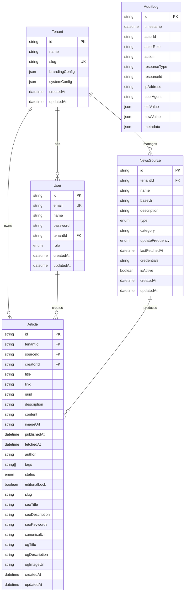

# Database Schema

This document describes the database schema for the News Aggregator CMS.

## ER Diagram (Mermaid)

## Model Descriptions

### Tenant
Represents an organization using the platform.
- `brandingConfig`: JSON storing logo URL, colors, platform name, etc.
- `systemConfig`: JSON storing global settings like AI model preference.

### User
Users belonging to a tenant.
- `role`: ADMIN, EDITOR, or VIEWER.
- `name`: Display name.

### NewsSource
External sources (RSS, API) configured for ingestion.

### Article
The core content unit.
- `creatorId`: The user who created or last modified the article (if manual).
- `editorialLock`: Prevents automated updates from overwriting manual edits.

### AuditLog
Immutable record of all system actions.
